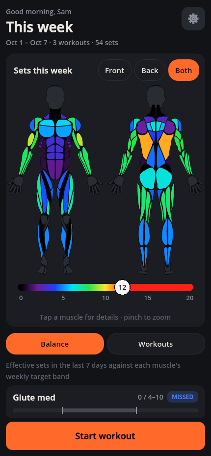

# hotMuscles

A heatmap-based workout tracker. Log your sets and watch the muscles you've trained light up on a body,
so you can see at a glance what's been worked this week and what's been skipped.

Made in Godot 4.3 for Android (it also builds for Windows).

## Download and try it

You don't need any of the code to try it. Grab the file for your device:

| Device | Download | Size |
|---|---|---|
| **Android phone** | [hotMuscles.apk](https://github.com/aphyr-dev/hotMuscles/releases/latest/download/hotMuscles.apk) | ~25 MB |
| **Windows PC** | [hotMuscles-windows.exe](https://github.com/aphyr-dev/hotMuscles/releases/latest/download/hotMuscles-windows.exe) | ~82 MB |

Older versions and notes are on the [Releases page](https://github.com/aphyr-dev/hotMuscles/releases).

**Installing on Android:** open the link on your phone and tap the downloaded file. The app isn't on the
Play Store, so Android will ask you to allow installs from your browser first (a one-time switch), and Play
Protect may say it doesn't recognise the app: tap **Install anyway**.

**Running on Windows:** just double-click the exe; there's nothing to install. Windows may show "Windows
protected your PC" because the file isn't signed: click **More info**, then **Run anyway**.

Everything stays on your device. The app works offline and never sends anything anywhere.

## What it does

- **Log a workout**: pick exercises (search, equipment chips, favourites, templates), tap sets up and
  down, and watch this workout's heat land on the body. Tap a muscle to get the best exercises for it;
  hold one to pick several muscles at once.
- **See your week**: the home body shows today, the last 7 days, or the average week over a month or a
  year. A Balance tab ranks every muscle by how far it is from its target.
- **Targets for a sport or a look**: switch on researched presets (marathon, sprinting, basketball,
  football, swimming, cycling, climbing, boxing / MMA, V-taper, mew2, hourglass) or make your own. The
  body then shows how close each muscle is, and the exercises each preset leans on are tagged in the
  picker.
- **Cardio**: log minutes and how hard it felt (easy, hard, very hard). A red and blue vessel overlay
  lights up as you fill your weekly easy and hard cardio, with the WHO health minimum alongside.
- **Two looks**: Modern and Frutiger (glossy, bubbly Frutiger Aero), each in ten colour palettes.

## How it's built

A tour of the app's insides, with the file and function behind each part: [docs/hotMusclesArchitecture_v3.pdf](docs/hotMusclesArchitecture_v3.pdf)

## Licence: MIT

Do whatever you want with it: use it, change it, ship it, sell it. No permission needed. The one
condition (that's what MIT means) is to keep the [LICENSE](LICENSE) file with any copy, because it
also carries the credit lines for the body drawings below. The exercise list is public domain.

## Credits

- **Body drawings**: from [react-native-body-highlighter](https://github.com/HichamELBSI/react-native-body-highlighter)
  by ELABBASSI Hicham (MIT), taken via [MuscleMap](https://github.com/melihcolpan/MuscleMap) by Melih Colpan (MIT).
- **Exercise list**: [free-exercise-db](https://github.com/yuhonas/free-exercise-db), built on
  [wrkout/exercises.json](https://github.com/wrkout/exercises.json). Both public domain.
- **Exercise science**: the muscle shares, sport and physique targets and the cardio model are our own
  numbers, researched from published studies, position stands and coaching sources - every page we read is
  listed in [data/sources.md](data/sources.md#research-references). No other dataset is copied in.

More detail in [data/sources.md](data/sources.md).
